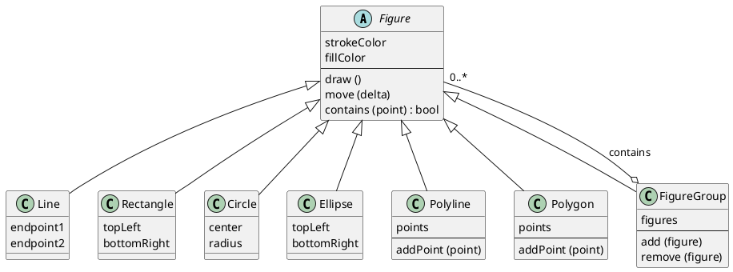
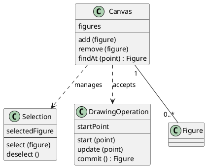

# ドメイン分析

図形エディタにおける図形と図形作成作業のドメインを分析する．
本文書のクラス図は実装と直接対応しなくてよい．

## 図形のクラス図

```plantuml
@startuml domain-figures

abstract class Figure {
    strokeColor
    fillColor
    --
    draw ()
    move (delta)
    contains (point) : bool
}

class Line {
    endpoint1
    endpoint2
}

class Rectangle {
    topLeft
    bottomRight
}

class Circle {
    center
    radius
}

class Ellipse {
    topLeft
    bottomRight
}

class Polyline {
    points
    --
    addPoint (point)
}

class Polygon {
    points
    --
    addPoint (point)
}

class FigureGroup {
    figures
    --
    add (figure)
    remove (figure)
}

Figure <|-- Line
Figure <|-- Rectangle
Figure <|-- Circle
Figure <|-- Ellipse
Figure <|-- Polyline
Figure <|-- Polygon
Figure <|-- FigureGroup
FigureGroup o-- "0..*" Figure : contains

@enduml
```

## 図形作業のクラス図

```plantuml
@startuml domain-operations

class Canvas {
    figures
    --
    add (figure)
    remove (figure)
    findAt (point) : Figure
}

class Selection {
    selectedFigure
    --
    select (figure)
    deselect ()
}

class DrawingOperation {
    startPoint
    --
    start (point)
    update (point)
    commit () : Figure
}

Canvas "1" -- "0..*" Figure
Canvas ..> Selection : manages
Canvas ..> DrawingOperation : accepts

@enduml
```
