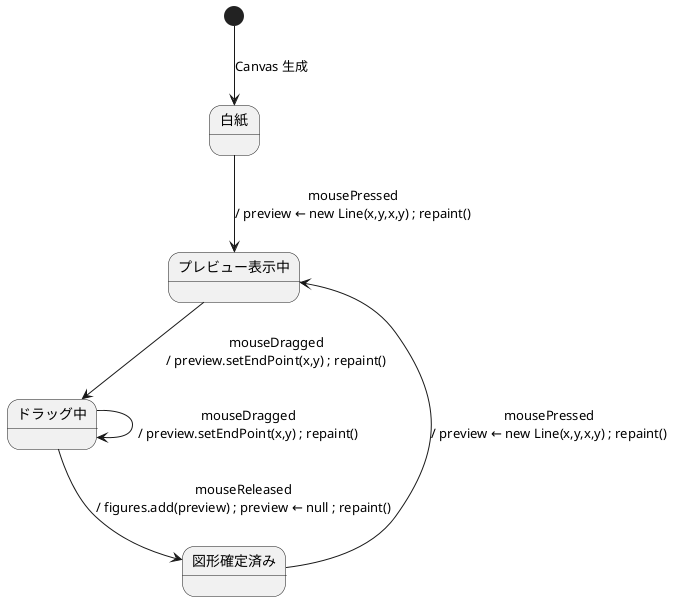
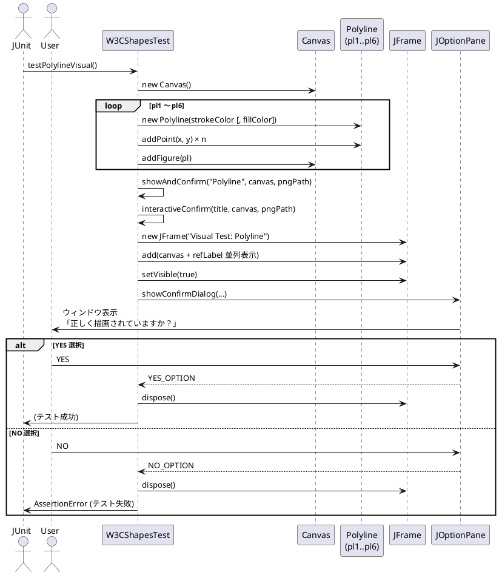

# 動的過程

## Canvas の状態機械図 — Line を 1 本描く場合

DrawLineTool を使ってマウス操作で Line を 1 本描く際の Canvas の状態遷移を示す．
Canvas の状態は `figures` リストと `preview` フィールドの組み合わせで定まる．

遷移のトリガーは `EditorController` がマウスイベントを受けて `DrawLineTool` の各メソッドを呼び出し，
`DrawLineTool` が `Canvas` の `setPreview()`・`addFigure()`・`repaint()` を呼び出すことで生じる．

## W3CShapesTest.testPolylineVisual()

`testPolylineVisual()` は Polyline 図形を Canvas に追加し，参照 PNG と比較して描画の正しさを確認するテストメソッドである．
自動比較モード (`-Dvisual.auto=true`) と目視確認モード (デフォルト) の 2 つの実行経路を持つ．

