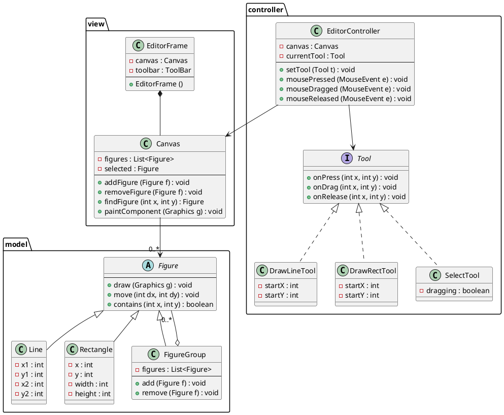

# 静的構造

最初に実装する GUI アプリケーションのクラス構成を示す．

## クラス図

## パッケージ構成

| パッケージ | 役割 |
|---|---|
| `model` | 図形クラスの階層 |
| `view` | Swing コンポーネント (フレーム・キャンバス) |
| `controller` | マウスイベント処理とツール抽象化 |

## 補足

- `Canvas` は `JPanel` のサブクラスとして実装し，`paintComponent` をオーバーライドして図形を描画する
- `Tool` インタフェースにより，描画・選択ツールを統一的に扱う
- `EditorController` は `MouseListener`/`MouseMotionListener` を実装する
