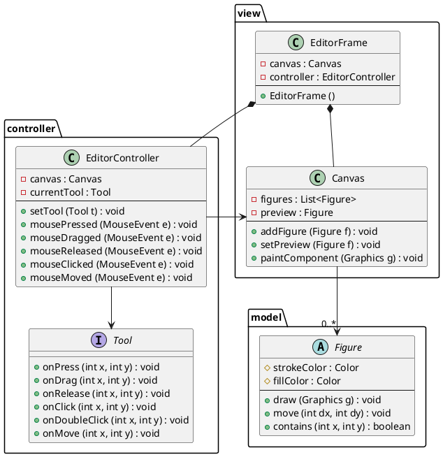
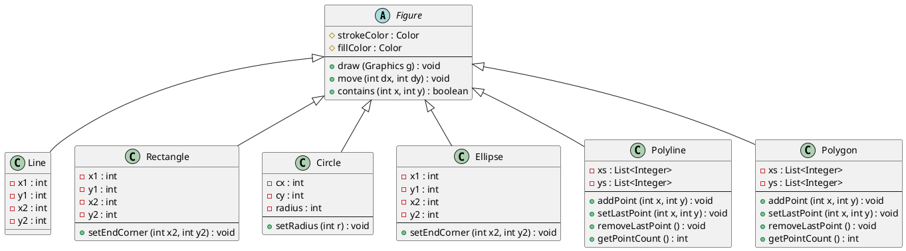
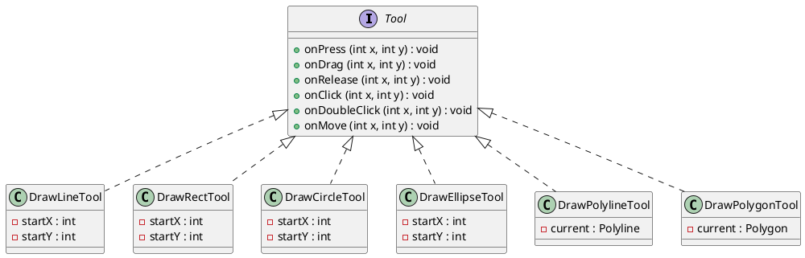

# 静的構造

GUI アプリケーションのクラス構成を示す．

## クラス図 1: 全体構造

EditorFrame から Tool と Figure までの関係を示す．
各クラスの詳細は「クラス図 2」を参照．

## クラス図 2: 詳細

### Figure 階層

### Tool 階層

## パッケージ構成

| パッケージ | 役割 |
|---|---|
| `model` | 図形クラスの階層 |
| `view` | Swing コンポーネント (フレーム・キャンバス) |
| `controller` | マウスイベント処理とツール抽象化 |

## 補足

- `Canvas` は `JPanel` のサブクラスとして実装し，`paintComponent` をオーバーライドして図形を描画する
- `Tool` インタフェースの `onClick`，`onDoubleClick`，`onMove` は `default` メソッドとして空実装を持つ
- `EditorController` は `MouseAdapter` を継承して実装する
- ドラッグ系ツール (`DrawLineTool` 等) は `onPress`/`onDrag`/`onRelease` を使用し，クリック系ツール (`DrawPolylineTool` 等) は `onClick`/`onDoubleClick`/`onMove` を使用する
