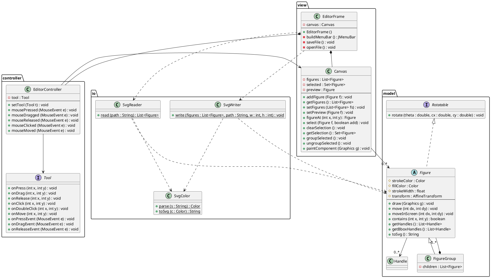
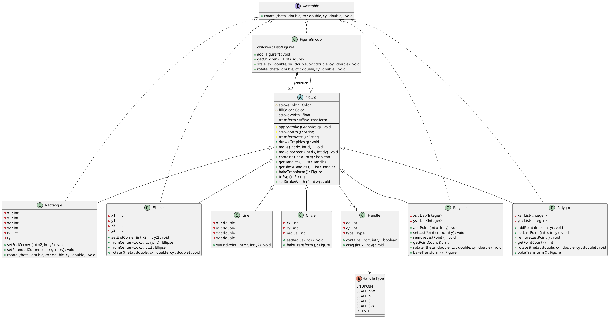
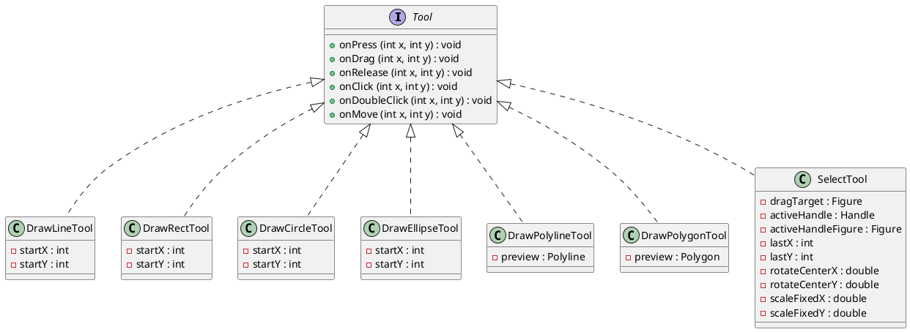

# 静的構造

GUI アプリケーションのクラス構成を示す．

## クラス図 1: 全体構造

EditorFrame から Tool と Figure までの関係，および SVG 入出力クラスを示す．
各クラスの詳細は「クラス図 2」を参照．

## クラス図 2: 詳細

### Figure 階層

### Tool 階層

## パッケージ構成

| パッケージ | 役割 |
|---|---|
| `model` | 図形クラスの階層 |
| `view` | Swing コンポーネント (フレーム・キャンバス) |
| `controller` | マウスイベント処理とツール抽象化 |
| `io` | SVG ファイルの読み書き |

## 補足

- `Canvas` は `JPanel` のサブクラスとして実装し，`paintComponent` をオーバーライドして図形を描画する
- `Tool` インタフェースの `onClick`，`onDoubleClick`，`onMove` は `default` メソッドとして空実装を持つ
- `EditorController` は `MouseAdapter` を継承して実装する
- ドラッグ系ツール (`DrawLineTool` 等) は `onPress`/`onDrag`/`onRelease` を使用し，クリック系ツール (`DrawPolylineTool` 等) は `onClick`/`onDoubleClick`/`onMove` を使用する
- `Figure` の `strokeWidth` は `Graphics2D.setStroke(new BasicStroke(...))` で適用し，可変太さの線描画を実現する
- `Rectangle` の `rx`/`ry` は SVG の角丸属性に対応し，`drawRoundRect`/`fillRoundRect` で描画する
- `SvgReader` は `<g>` 要素の `fill`/`stroke`/`stroke-width` と `transform="translate(...)"` を子要素に継承するスタイルコンテキストを持つ
- `FigureGroup` は Composite パターンを適用し，`draw`/`move`/`contains`/`toSvg` を子要素に委譲する．SVG の `<g>` 要素として入出力される
- `SelectTool` は `onPressEvent(MouseEvent)` をオーバーライドして `e.isControlDown()` で Ctrl+クリックによる複数選択を実現する．ドラッグ時は選択図形全体を移動する
- `Figure` は `AffineTransform transform` フィールドを持ち，`draw` 時に座標変換を適用する (テンプレートメソッドパターン)．`moveInScreen` はスクリーン空間での平行移動を transform に合成する
- `Figure.bakeTransform()` はグループ解除時に子図形の transform をローカル座標に焼き込む具象メソッドで，デフォルト実装は何もしない (null を返す)．Line, Polyline, Polygon はオーバーライドして座標を更新し transform をリセットする．`Circle.bakeTransform()` は非均一スケール時に `Ellipse` を返して図形を置き換える
- `Rotatable` インタフェースは `rotate()` を定義する．`FigureGroup`，`Rectangle`，`Ellipse` が実装し，回転ハンドルのドラッグで `SelectTool` から呼び出される
- `Handle` はハンドルの画面座標・種別・ドラッグコールバックを持つ値オブジェクト．`Figure.getHandles()` は端点ハンドル，`Figure.getBboxHandles()` は SCALE / ROTATE ハンドルを返す
